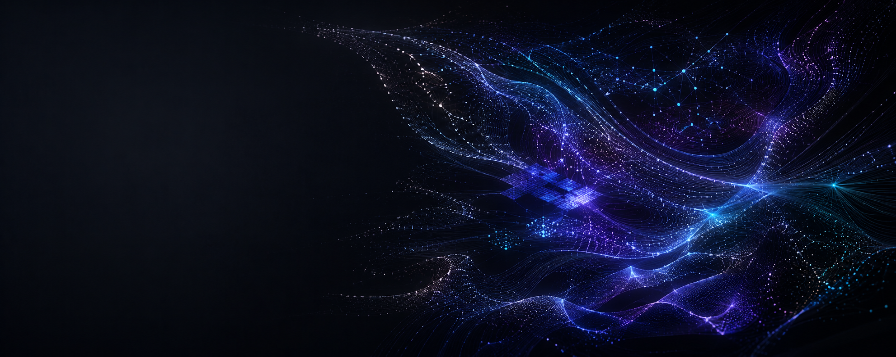

# Hey, I'm Zane

## Machine Learning & AI Engineer

I build perception and autonomy systems, and applied LLM tools, for domains where reliability and explainability matter: aerospace, marine, and field robotics, where benchmark scores aren't the point. My focus is turning messy, real-world data into models that hold up in production, and building the evaluation loops that make their behaviour measurable and trustworthy.

Day to day I work in **Python** and **PyTorch**, deploying with **TensorRT** and **Docker** onto real-time, resource-constrained edge hardware (NVIDIA Jetson) where "it works on my machine" isn't good enough. I also build applied **LLM / RAG** systems with an evaluation-first mindset.

*Currently: ML & AI at Syos Aerospace (perception, sensor fusion, multi-vehicle autonomy, and applied LLM / RAG systems). MSc (Research) in Artificial Intelligence, First Class Honours.*

---

### Tech Stack

---

### Featured Projects

**[RAG Pipeline with Evaluation Harness](https://github.com/xquantize/pgvector-rag-pipeline)** — retrieval-augmented generation over PostgreSQL + pgvector, built around a real evaluation harness. Hybrid vector and full-text retrieval fused in SQL, reproducible and diffable run reports, running fully offline on local models. Most RAG demos show one lucky query; this one measures retrieval quality on a fixed question set.

**[Residual Correction for Time-Series Foundation Models](https://github.com/xquantize/meta-ts-correction)** — a tiny corrector that learns a frozen foundation model's (Chronos) residuals to recover accuracy at a fraction of the compute. Leakage-audited evaluation harness, paper-grade significance testing, and honest negative results.

**[Nineville Studio](https://nineville.studio)** — a full-stack artist portfolio (Astro + TypeScript with a serverless contact pipeline), designed, built, and shipped end to end.

### Open Data & Analysis

Alongside code, I publish cleaned, well-documented datasets and analysis notebooks on [**Kaggle**](https://www.kaggle.com/zaneneave), sourced straight from official scientific APIs (USGS, Smithsonian GVP, NASA EONET) rather than scraped or recycled, and rated up to 10.0 usability.

**Datasets** include:
- [Global Earthquakes 2020–2026](https://www.kaggle.com/datasets/zaneneave/global-earthquakes-2020-2026) — 11,808 M5.0+ events (USGS)
- [Global Volcanic Eruptions: Holocene Record](https://www.kaggle.com/datasets/zaneneave/global-volcanic-eruptions-holocene-record) — 11,089 eruptions across 1,196 volcanoes (Smithsonian GVP)
- [Breast Cancer Clinical Trials: Cleaned & NLP](https://www.kaggle.com/datasets/zaneneave/breast-cancer-clinical-trials-cleaned-and-nlp-r) — NLP-processed clinical-trial data
- [Global Natural Events (NASA EONET)](https://www.kaggle.com/datasets/zaneneave/global-natural-events-nasa-eonet-20112026) and [Global Tsunami Events & Runups](https://www.kaggle.com/datasets/zaneneave/global-tsunami-events-and-runups-historical-data)

**Notebooks** include:
- [Natural Hazards with DuckDB](https://www.kaggle.com/code/zaneneave/what-where-when-natural-hazards-with-duckdb) — querying the hazard datasets with DuckDB
- [Catch the Hidden Data Leak](https://www.kaggle.com/code/zaneneave/asian-monsoon-floods-catch-the-hidden-data-leak) — finding and fixing target leakage in a flood dataset
- [Wine Quality: EDA to SHAP](https://www.kaggle.com/code/zaneneave/red-wine-quality-eda-to-shap-explained-for-newbs) — end-to-end EDA and explainable ML

More on my [Kaggle profile →](https://www.kaggle.com/zaneneave)

---

### Background

- MSc (Research) in Artificial Intelligence, First Class Honours — thesis on embedding-based image retrieval for trustworthy AI ([Research Commons](https://hdl.handle.net/10289/17493))
- BE (Hons) in Mechatronics Engineering, First Class Honours

---

### Let's Connect

Open to collaborations, remote roles, and conversations about deep tech that actually ships. Reach out on [LinkedIn](https://www.linkedin.com/in/zane-neave-rex/).

---

### Outside of Code

You'll usually find me surfing, playing football, or somewhere on the coast.
